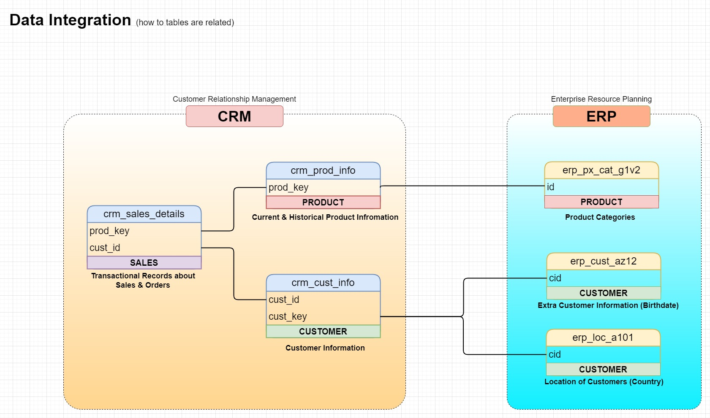

# 🚀 Data Warehouse Project

## 📌 Introduction

Data-driven decision-making is crucial in modern businesses, but **raw data from multiple sources** often lacks structure and consistency. This project aims to build a **scalable and well-structured Data Warehouse** using the **Medallion Architecture** (Bronze, Silver, Gold layers) to **transform raw data into business-ready insights**.

🔹 **Why This Project?**  
- To implement a **structured ETL pipeline** that processes raw data into a **well-modeled** warehouse.  
- To ensure **data quality, consistency, and reliability** for analytics and reporting.  
- To demonstrate **SQL-based transformations, data integration, and star schema modeling**.

---

## 🏛️ Medallion Architecture Overview

This **Medallion Architecture** follows a **layered approach** to **improve data quality and ensure scalability**.

### **Understanding Medallion Architecture**


📌 **Layers Breakdown**:
- **Bronze Layer** → Stores **raw, unprocessed data** as received from various sources (CRM, ERP).  
- **Silver Layer** → Applies **data cleansing, validation, and structuring** to create a standardized format.  
- **Gold Layer** → Provides **business-ready** data modeled for reporting and analytics.  

Each layer refines the data, making it more **trustworthy, accurate, and useful**.

---

## 🔥 Data Warehouse Architecture

The following diagram represents the **core architecture of this data warehouse**.  
It illustrates **how data moves from sources to structured reporting layers**.

### **Complete Data Warehouse Architecture**


- **Source Systems**: CRM, ERP, and other data sources.
- **ETL Pipeline**: Data is extracted, transformed, and loaded across **Bronze → Silver → Gold layers**.
- **Consumption Layer**: Business intelligence tools and reports use the final processed data.

This **end-to-end workflow** ensures **high-quality data** is available for analytics.

---

## 🔗 Data Sources & Integration

The project integrates **data from two primary systems**:  
✅ **Customer Relationship Management (CRM)** → Sales transactions, customer details, and product information.  
✅ **Enterprise Resource Planning (ERP)** → Product categorization, customer birthdates, and location details.

### **How Data is Connected Across Systems**


- **CRM stores** sales, customer, and product information.  
- **ERP contains** product categories and additional customer details.  
- The integration ensures a **complete, unified dataset** for analysis.

---

## 🔄 Data Processing Pipeline

### **End-to-End Data Flow**
The data follows a structured **Extract, Transform, Load (ETL) process** as shown below:


- **Raw data is extracted** from various sources.  
- The **Bronze Layer** holds unprocessed data.  
- The **Silver Layer** applies cleansing, validation, and transformation.  
- The **Gold Layer** provides business-ready models for analytics.  

🔹 **Key Transformations Applied**:

✔ **Data Cleansing** → Handling missing values, fixing inconsistencies.  
✔ **Data Standardization** → Converting formats for uniformity.  
✔ **Data Normalization** → Structuring data for efficient storage.  
✔ **Derived Columns** → Creating calculated fields for better analysis.  
✔ **Data Enrichment** → Merging datasets for enhanced insights.  

---

## 📊 Data Modeling (Star Schema)

The **Gold Layer** follows a **Star Schema** to improve query performance and optimize data for analytics.

### **Sales Data Mart - Star Schema**


📌 **Schema Details**:
- **Fact Table**: `fact_sales` stores **transactional data** like orders, revenue, and quantities.  
- **Dimension Tables**:
  - `dim_customers` → Contains **customer details** like name, location, and demographics.  
  - `dim_products` → Stores **product metadata**, categories, and cost details.

This **denormalized schema** ensures **fast query performance** for analytics.

---

## 📂 Folder Structure

```plaintext
data-warehouse-project/
│
├── datasets/                           # Source data (CRM & ERP CSV files)
│
├── docs/                               # Project documentation & architecture diagrams
│   ├── MEDALLION ARCHITECTURE.jpg      # Bronze, Silver, Gold layers
│   ├── Architecture DW Project.jpg     # Full project architecture overview
│   ├── data_integration.jpg            # CRM & ERP integration
│   ├── DATA MART STAR SCHEMA.jpg       # Star Schema structure
│   ├── Data Flow.jpg                   # ETL pipeline flow
│
├── scripts/                            # SQL scripts for ETL & transformations
│   ├── bronze/                         # Extract & load raw data
│   ├── silver/                         # Data cleansing & transformations
│   ├── gold/                           # Business-ready transformations
│
├── tests/                              # Data validation & integrity checks
│
├── README.md                           # Project overview & documentation
├── LICENSE                             # Open-source license
├── .gitignore                          # Files ignored by Git
└── requirements.txt                    # Dependencies & requirements
